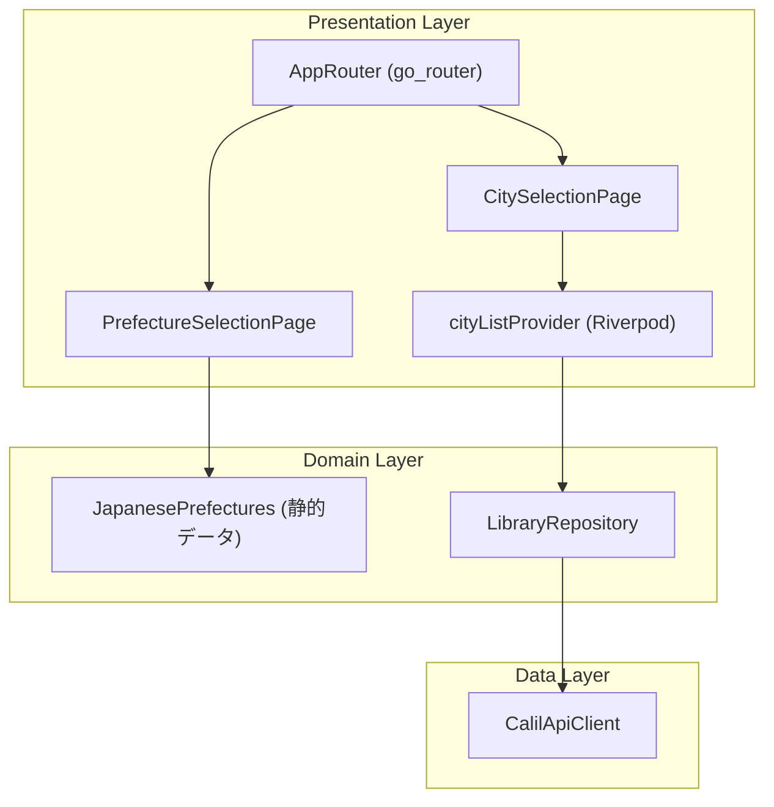
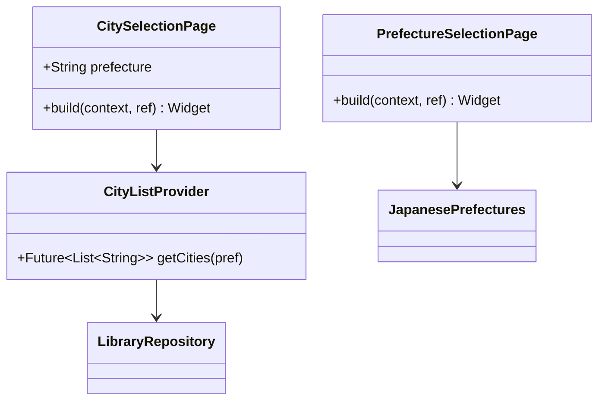
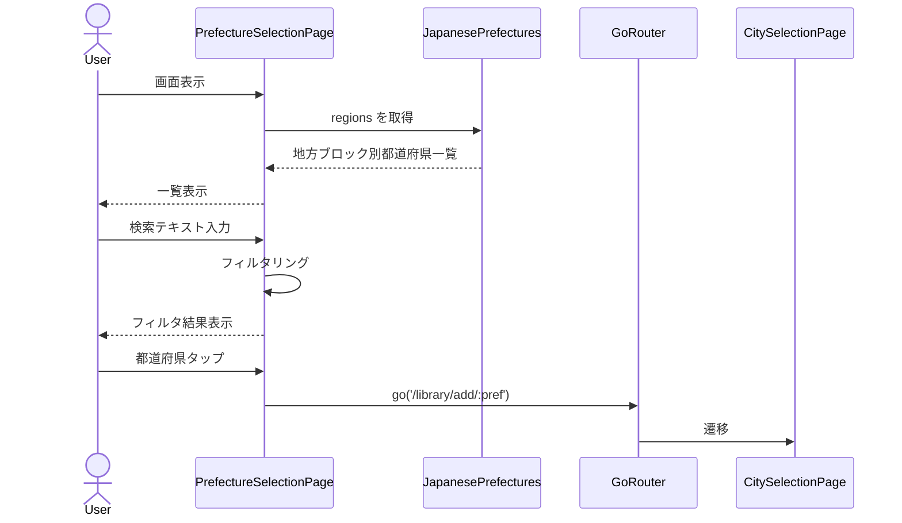
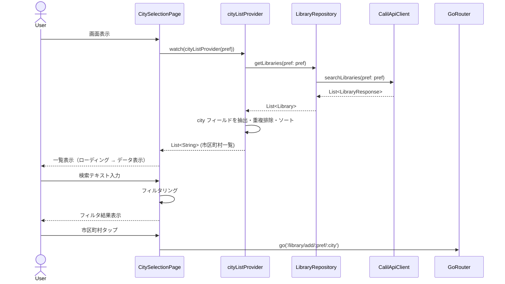

# Issue #9: 都道府県・市区町村選択UI - 設計

## Architecture Overview

Clean Architecture に基づき、都道府県の静的データをドメイン層で定義する。市区町村データはカーリルAPIの `/library` エンドポイントから動的に取得し、レスポンスの `city` フィールドからユニークな市区町村一覧を構築する。go_router を導入して宣言的ルーティングを実現する。



## Component Design

### Domain Layer

#### `lib/domain/data/japanese_prefectures.dart`

47都道府県を地方ブロックごとにグループ化した静的データ。都道府県名はカーリルAPIのドキュメントに記載されている正式名称（例: "青森県"、"埼玉県"）を使用する。

```dart
class RegionGroup {
  const RegionGroup({required this.name, required this.prefectures});
  final String name;
  final List<String> prefectures;
}

class JapanesePrefectures {
  static const List<RegionGroup> regions = [
    RegionGroup(name: '北海道・東北', prefectures: ['北海道', '青森県', ...]),
    RegionGroup(name: '関東', prefectures: ['茨城県', '栃木県', ...]),
    // ...
  ];

  static List<String> get allPrefectures => regions.expand((r) => r.prefectures).toList();
}
```

### Presentation Layer

#### `lib/presentation/pages/prefecture_selection_page.dart`

都道府県選択画面。地方ブロックごとにグループ化されたリストと検索バーを持つ。

#### `lib/presentation/pages/city_selection_page.dart`

市区町村選択画面。カーリルAPIから取得した図書館データの `city` フィールドを元に、ユニークな市区町村一覧を表示する。



#### `lib/presentation/providers/city_providers.dart`

市区町村一覧を取得する Riverpod プロバイダー。

```dart
// 都道府県を引数に取り、カーリルAPIから図書館一覧を取得し、
// レスポンスのcityフィールドからユニークな市区町村リストを返す
final cityListProvider = FutureProvider.family<List<String>, String>((ref, pref) async {
  final repository = ref.watch(libraryRepositoryProvider);
  final libraries = await repository.getLibraries(pref: pref);
  final cities = libraries.map((lib) => lib.city).toSet().toList()..sort();
  return cities;
});
```

### Routing (go_router)

#### `lib/presentation/router/app_router.dart`

go_router による宣言的ルーティング定義。

```dart
// ルート定義
// /                        → HomePage
// /library/add             → PrefectureSelectionPage
// /library/add/:pref       → CitySelectionPage
// /library/add/:pref/:city → LibraryListPage (次Issue)
```

`MaterialApp` を `MaterialApp.router` に変更し、go_router を接続する。

## Data Flow

### 都道府県選択フロー



### 市区町村選択フロー



## Domain Models

このIssueでは既存のドメインモデルに変更はなし。新たに以下を追加する:

- `RegionGroup`: 地方ブロック名と所属都道府県のリスト
- `JapanesePrefectures`: 47都道府県の静的データ
- `cityListProvider`: カーリルAPIから市区町村一覧を動的に取得するプロバイダー

市区町村の静的データクラス（`JapaneseCities`）は不要。カーリルAPIの `/library` エンドポイントのレスポンスから `city` フィールドを抽出することで、APIと一致する値が保証され、かつ図書館が存在する市区町村のみが表示される。
