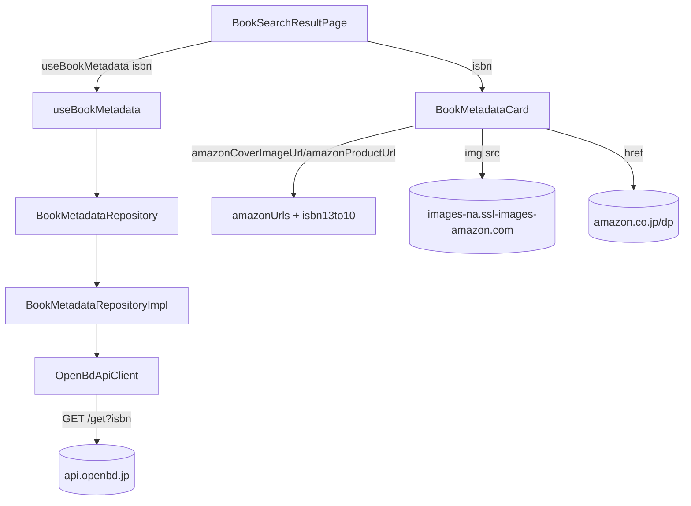

# 書影・タイトル・購入リンク表示 — Design

## Architecture Overview

Clean Architecture の各層に責務を分割する。書影URL・購入リンクは ISBN から純粋に導出（ネットワーク不要）、タイトルは OpenBD から非同期取得（ネットワーク依存）し、両者を分離することで「OpenBD が失敗しても書影とリンクは出る」グレースフルデグラデーションを実現する。



## Component Design

### Domain
- `utils/isbn13to10`（`isbnValidator` に追加）: ISBN-13(978) → ISBN-10。979/不正は null。
- `utils/amazonUrls`（新規・純粋関数）:
  - `amazonProductUrl(isbn, associateTag?)`: `/dp/{isbn10}`、導出不可なら `/s?k={isbn13}`。`associateTag` 指定時は `tag=` を付与（アフィリエイト）。
  - `amazonCoverImageUrl(isbn)`: Amazon CDN URL、導出不可なら null。

### アフィリエイト（環境切替）
- アソシエイトタグはビルド時環境変数 `VITE_AMAZON_ASSOCIATE_TAG`（公開値）で管理。`src/presentation/config/amazonAffiliate.ts` が読み取り、`BookMetadataCard` の既定 `associateTag` に渡す。
- ローカル開発（未設定）→ 通常リンク・開示文なし。本番ビルド（デプロイワークフローが GitHub リポジトリ変数 `AMAZON_ASSOCIATE_TAG` を `VITE_AMAZON_ASSOCIATE_TAG` として注入）→ アフィリエイトリンク・開示文表示。
- タグは URL に現れる公開値のため Secret ではなく Variable／`VITE_` で管理（Calil app key とは性質が異なる）。
- `models/bookMetadata`（新規）: OpenBD 由来のフィールド（title/author/publisher/coverImageUrl）。
- `repositories/bookMetadataRepository`（新規）: `getByIsbn(isbn): Promise<BookMetadata | null>`。

### Data
- `datasources/openBdApiConfig`（新規）: baseUrl/timeout。
- `models/openBdResponse`（新規）: OpenBD レスポンス最小 DTO。
- `datasources/openBdApiClient`（新規）: `getByIsbn` で `GET {baseUrl}/get?isbn=` し配列先頭を返す。`CalilApiClient` 同様 `fetchFn` 注入＋`AbortController` タイムアウト。
- `repositories/bookMetadataRepositoryImpl`（新規）: OpenBD `summary` → `BookMetadata` マップ。該当なし null。

### Presentation
- `hooks/useBookMetadata`（新規）: `useQuery(['bookMetadata', isbn])`。
- `widgets/BookMetadataCard`（新規・プレゼンテーショナル）: props `{ isbn, title?, openBdCoverUrl? }`。書影は Amazon→OpenBD→プレースホルダの順でフォールバック（`onError` と Amazon の 1x1 グレー画像対策の `onLoad` naturalWidth 判定）。「Amazonで見る」ボタンを表示。
- `pages/BookSearchResultPage`（改修）: `useBookMetadata` を呼び、登録図書館がある場合は ISBN セクション直後に `BookMetadataCard` を常時表示（蔵書状況の loading/error/result とは独立）。

### DI
- `app/dependencies`: `openBdApiClient`/`bookMetadataRepository` を追加・配線。
- `test/testUtils`: `FakeBookMetadataRepository` を追加し `makeFakeDeps` の既定に組込み。

## Data Flow

1. ページが `isbn` を取得 → `useBookMetadata(isbn)` 起動。
2. 並行して `BookMetadataCard` が `isbn` から書影URL・購入URLを同期生成し即描画。
3. OpenBD からタイトルが返ったらカードのタイトルを更新。失敗時は書影＋リンクのみで継続。
4. 蔵書状況は従来フロー（`useBookAvailability`）のまま、メタデータと独立に描画。

## Domain Models

```ts
export interface BookMetadata {
  isbn: string;
  title?: string;
  author?: string;
  publisher?: string;
  coverImageUrl?: string; // OpenBD cover（Amazon書影フォールバック用）
}
```

## グレースフルデグラデーションの設計判断

書影URL・購入リンクは ISBN から純粋導出できる（ネットワーク不要）。よってタイトル取得（OpenBD・ネットワーク依存）とは分離し、メタデータ query の失敗をページ全体の `errorState` に波及させない。これにより外部 API 障害時も中核の蔵書状況表示は無影響。
