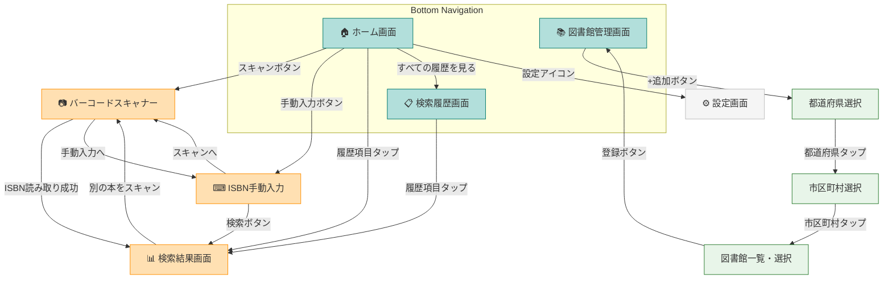

# LibCheck デザインガイドライン

## 1. デザインガイドライン

### 1.1 カラーパレット

Material Design 3 のカラーシステムに基づき、図書館・書籍をイメージした落ち着きのある配色を採用する。

| 用途 | カラー名 | Hex | 説明 |
|------|---------|-----|------|
| Primary | Teal | `#00796B` | 知的・信頼感を表す深いティール |
| On Primary | White | `#FFFFFF` | Primary 上のテキスト・アイコン |
| Primary Container | Light Teal | `#B2DFDB` | カード背景・ハイライト用の薄いティール |
| On Primary Container | Dark Teal | `#004D40` | Primary Container 上のテキスト |
| Secondary | Amber | `#FF8F00` | アクセントカラー。CTA ボタン・バッジなど |
| On Secondary | White | `#FFFFFF` | Secondary 上のテキスト |
| Secondary Container | Light Amber | `#FFE0B2` | Secondary 系の背景色 |
| On Secondary Container | Dark Amber | `#E65100` | Secondary Container 上のテキスト |
| Surface | White | `#FAFAFA` | 画面背景色 |
| On Surface | Dark Gray | `#212121` | 通常テキスト |
| Surface Variant | Light Gray | `#F5F5F5` | カード・リストの背景色 |
| On Surface Variant | Medium Gray | `#757575` | 補助テキスト |
| Error | Red | `#D32F2F` | エラー表示 |
| On Error | White | `#FFFFFF` | Error 上のテキスト |
| Error Container | Light Red | `#FFCDD2` | エラー背景 |
| Outline | Gray | `#BDBDBD` | ボーダー・ディバイダー |

#### セマンティックカラー（蔵書状態）

| 状態 | カラー | Hex | 説明 |
|------|--------|-----|------|
| 貸出可能 | Green | `#2E7D32` | 蔵書あり・貸出可能 |
| 貸出中 | Orange | `#EF6C00` | 蔵書あり・貸出中 |
| 蔵書なし | Gray | `#9E9E9E` | 蔵書なし |
| エラー | Red | `#D32F2F` | 取得失敗 |

#### Dart コード例

```dart
// lib/core/theme/app_colors.dart
class AppColors {
  // Primary
  static const primary = Color(0xFF00796B);
  static const onPrimary = Color(0xFFFFFFFF);
  static const primaryContainer = Color(0xFFB2DFDB);
  static const onPrimaryContainer = Color(0xFF004D40);

  // Secondary
  static const secondary = Color(0xFFFF8F00);
  static const onSecondary = Color(0xFFFFFFFF);
  static const secondaryContainer = Color(0xFFFFE0B2);
  static const onSecondaryContainer = Color(0xFFE65100);

  // Surface
  static const surface = Color(0xFFFAFAFA);
  static const onSurface = Color(0xFF212121);
  static const surfaceVariant = Color(0xFFF5F5F5);
  static const onSurfaceVariant = Color(0xFF757575);

  // Error
  static const error = Color(0xFFD32F2F);
  static const onError = Color(0xFFFFFFFF);
  static const errorContainer = Color(0xFFFFCDD2);

  // Semantic - 蔵書状態
  static const statusAvailable = Color(0xFF2E7D32);
  static const statusCheckedOut = Color(0xFFEF6C00);
  static const statusNotFound = Color(0xFF9E9E9E);
}
```

### 1.2 タイポグラフィ

Material Design 3 の Type Scale に準拠。日本語フォントはシステムデフォルト（Noto Sans JP 相当）を使用する。

| スタイル | 用途 | サイズ | ウェイト | 行間 |
|----------|------|--------|---------|------|
| Display Large | - | 57sp | 400 | 64sp |
| Display Medium | - | 45sp | 400 | 52sp |
| Display Small | - | 36sp | 400 | 44sp |
| Headline Large | 画面タイトル | 32sp | 400 | 40sp |
| Headline Medium | セクション見出し | 28sp | 400 | 36sp |
| Headline Small | カード見出し | 24sp | 400 | 32sp |
| Title Large | AppBar タイトル | 22sp | 500 | 28sp |
| Title Medium | リストタイトル | 16sp | 500 | 24sp |
| Title Small | サブタイトル | 14sp | 500 | 20sp |
| Body Large | 本文（主要） | 16sp | 400 | 24sp |
| Body Medium | 本文（通常） | 14sp | 400 | 20sp |
| Body Small | 補助テキスト | 12sp | 400 | 16sp |
| Label Large | ボタンラベル | 14sp | 500 | 20sp |
| Label Medium | チップ・バッジ | 12sp | 500 | 16sp |
| Label Small | キャプション | 11sp | 500 | 16sp |

### 1.3 コンポーネントスタイル

#### ボタン

| 種別 | 用途 | スタイル |
|------|------|---------|
| FilledButton | 主要アクション（スキャン開始、登録確定） | 背景: Primary, テキスト: On Primary, 角丸: 20dp |
| OutlinedButton | 副次アクション（キャンセル、戻る） | ボーダー: Primary, テキスト: Primary, 角丸: 20dp |
| TextButton | 軽微なアクション（詳細を見る、スキップ） | テキスト: Primary |
| FloatingActionButton | 画面の主要アクション（バーコードスキャン） | 背景: Secondary, アイコン: On Secondary |
| IconButton | ナビゲーション・補助操作 | アイコン: On Surface Variant |

#### カード

```
┌─────────────────────────────────────┐
│  elevation: 1                       │
│  shape: RoundedRectangle(12dp)      │
│  color: Surface                     │
│  margin: 8dp (vertical)             │
│  padding: 16dp                      │
└─────────────────────────────────────┘
```

- **通常カード**: elevation 1, Surface 背景
- **強調カード**: elevation 0, Primary Container 背景
- **エラーカード**: elevation 0, Error Container 背景

#### ListTile

```
┌─────────────────────────────────────┐
│ [Leading]  Title              [>]   │
│            Subtitle                 │
└─────────────────────────────────────┘
```

- Leading: 40dp x 40dp（アイコンまたはサムネイル）
- タイトル: Title Medium
- サブタイトル: Body Small, On Surface Variant
- 高さ: 72dp（2行）/ 56dp（1行）
- パディング: 水平 16dp

#### テキスト入力フィールド

- スタイル: `OutlinedTextField`（Material 3）
- ボーダー: Outline カラー（フォーカス時: Primary）
- 角丸: 12dp
- ラベル: Body Small, On Surface Variant
- エラーテキスト: Body Small, Error
- パディング: 水平 16dp, 垂直 12dp

### 1.4 スペーシング・レイアウト

#### スペーシングスケール

| トークン | 値 | 用途 |
|---------|-----|------|
| xs | 4dp | アイコンとテキストの間隔 |
| sm | 8dp | 関連要素間の間隔 |
| md | 16dp | 画面パディング、カード内パディング |
| lg | 24dp | セクション間の間隔 |
| xl | 32dp | 大きなセクション間の間隔 |
| xxl | 48dp | ページ上部のマージン |

#### 画面レイアウト基本構造

```
┌──────────────────────────────────┐
│         AppBar (56dp)            │
├──────────────────────────────────┤
│  padding: 16dp (horizontal)      │
│                                  │
│  [Content Area]                  │
│                                  │
│                                  │
│                                  │
│                                  │
├──────────────────────────────────┤
│     BottomNavigationBar (80dp)   │
└──────────────────────────────────┘
```

- 画面の水平パディング: 16dp
- コンテンツ間の垂直間隔: 16dp（同一セクション）/ 24dp（異なるセクション）
- Safe Area を考慮

---

## 2. 画面ワイヤーフレーム

### 2.1 ホーム画面

アプリのメインエントリーポイント。バーコードスキャンへの素早いアクセスと、最近の検索履歴を表示する。

```
┌──────────────────────────────────┐
│  LibCheck                  [⚙]   │
├──────────────────────────────────┤
│                                  │
│  ┌──────────────────────────┐    │
│  │                          │    │
│  │    📷 バーコードスキャン    │    │
│  │    タップしてスキャン開始    │    │
│  │                          │    │
│  └──────────────────────────┘    │
│                                  │
│  ┌──────────────────────────┐    │
│  │  ⌨ ISBN手動入力           │    │
│  └──────────────────────────┘    │
│                                  │
│  ─── 最近の検索 ──────────────   │
│                                  │
│  ┌──────────────────────────┐    │
│  │ [📖] 書籍タイトル1        │    │
│  │      著者名 | 🟢 貸出可能  │    │
│  └──────────────────────────┘    │
│  ┌──────────────────────────┐    │
│  │ [📖] 書籍タイトル2        │    │
│  │      著者名 | 🟠 貸出中    │    │
│  └──────────────────────────┘    │
│  ┌──────────────────────────┐    │
│  │ [📖] 書籍タイトル3        │    │
│  │      著者名 | ⚫ 蔵書なし   │    │
│  └──────────────────────────┘    │
│                                  │
│        すべての履歴を見る >       │
│                                  │
├──────────────────────────────────┤
│  [🏠ホーム]  [📚図書館]  [📋履歴] │
└──────────────────────────────────┘
```

**構成要素:**
- AppBar: アプリ名 + 設定アイコン
- スキャンボタン（大きな Card 形式、Secondary カラー）
- ISBN 手動入力ボタン（OutlinedButton）
- 最近の検索履歴（最大3件）
- 「すべての履歴を見る」リンク
- BottomNavigationBar（3タブ）

### 2.2 図書館登録フロー

#### 2.2.1 図書館管理画面（図書館タブ）

```
┌──────────────────────────────────┐
│  登録図書館                [+追加] │
├──────────────────────────────────┤
│                                  │
│  ┌──────────────────────────┐    │
│  │ 🏛 東京都立中央図書館      │    │
│  │   東京都港区              [×] │
│  └──────────────────────────┘    │
│  ┌──────────────────────────┐    │
│  │ 🏛 港区立みなと図書館      │    │
│  │   東京都港区              [×] │
│  └──────────────────────────┘    │
│                                  │
│                                  │
│  ─── ヒント ─────────────────   │
│  図書館を登録すると、バーコード    │
│  スキャンで蔵書を検索できます。    │
│                                  │
├──────────────────────────────────┤
│  [🏠ホーム]  [📚図書館]  [📋履歴] │
└──────────────────────────────────┘
```

#### 2.2.2 都道府県選択画面

```
┌──────────────────────────────────┐
│  [←] 都道府県を選択              │
├──────────────────────────────────┤
│  🔍 都道府県を検索...             │
├──────────────────────────────────┤
│                                  │
│  ── 北海道・東北 ──              │
│  ┌──────────────────────────┐    │
│  │  北海道                   >│    │
│  ├──────────────────────────┤    │
│  │  青森県                   >│    │
│  ├──────────────────────────┤    │
│  │  岩手県                   >│    │
│  ├──────────────────────────┤    │
│  │  ...                      │    │
│  └──────────────────────────┘    │
│                                  │
│  ── 関東 ──                     │
│  ┌──────────────────────────┐    │
│  │  東京都                   >│    │
│  ├──────────────────────────┤    │
│  │  神奈川県                 >│    │
│  ├──────────────────────────┤    │
│  │  ...                      │    │
│  └──────────────────────────┘    │
│                                  │
└──────────────────────────────────┘
```

#### 2.2.3 市区町村選択画面

```
┌──────────────────────────────────┐
│  [←] 東京都の市区町村             │
├──────────────────────────────────┤
│  🔍 市区町村を検索...             │
├──────────────────────────────────┤
│                                  │
│  ┌──────────────────────────┐    │
│  │  千代田区                 >│    │
│  ├──────────────────────────┤    │
│  │  中央区                   >│    │
│  ├──────────────────────────┤    │
│  │  港区                     >│    │
│  ├──────────────────────────┤    │
│  │  新宿区                   >│    │
│  ├──────────────────────────┤    │
│  │  ...                      │    │
│  └──────────────────────────┘    │
│                                  │
└──────────────────────────────────┘
```

#### 2.2.4 図書館一覧・選択画面

```
┌──────────────────────────────────┐
│  [←] 港区の図書館                │
├──────────────────────────────────┤
│                                  │
│  ┌──────────────────────────┐    │
│  │ ☑ 東京都立中央図書館       │    │
│  │   港区南麻布5-7-13        │    │
│  └──────────────────────────┘    │
│  ┌──────────────────────────┐    │
│  │ ☐ 港区立みなと図書館       │    │
│  │   港区芝浦3-16-25        │    │
│  └──────────────────────────┘    │
│  ┌──────────────────────────┐    │
│  │ ☐ 港区立高輪図書館        │    │
│  │   港区高輪1-16-25        │    │
│  └──────────────────────────┘    │
│  ┌──────────────────────────┐    │
│  │ ☐ 港区立麻布図書館        │    │
│  │   港区六本木5-12-24       │    │
│  └──────────────────────────┘    │
│                                  │
│                                  │
│  ┌──────────────────────────┐    │
│  │   選択した図書館を登録する    │    │
│  │       （1件選択中）          │    │
│  └──────────────────────────┘    │
│                                  │
└──────────────────────────────────┘
```

### 2.3 バーコードスキャナー画面

```
┌──────────────────────────────────┐
│  [←] バーコードスキャン    [💡]   │
├──────────────────────────────────┤
│                                  │
│  ┌ ─ ─ ─ ─ ─ ─ ─ ─ ─ ─ ─ ─┐   │
│  │                            │   │
│  │                            │   │
│  │     カメラプレビュー領域     │   │
│  │                            │   │
│  │  ┌────────────────────┐   │   │
│  │  │  スキャンガイド枠    │   │   │
│  │  │  (半透明オーバーレイ) │   │   │
│  │  └────────────────────┘   │   │
│  │                            │   │
│  │                            │   │
│  └ ─ ─ ─ ─ ─ ─ ─ ─ ─ ─ ─ ─┘   │
│                                  │
│  ┌──────────────────────────┐    │
│  │  ISBN: 978-4-XXXX-XXXX-X │    │
│  │  (読み取り結果をここに表示) │    │
│  └──────────────────────────┘    │
│                                  │
│  バーコードをガイド枠に            │
│  合わせてください                  │
│                                  │
│  ┌──────────────────────────┐    │
│  │    ISBN を手動入力する     │    │
│  └──────────────────────────┘    │
│                                  │
└──────────────────────────────────┘
```

**構成要素:**
- AppBar: 戻るボタン + フラッシュライト切替
- カメラプレビュー（画面上半分〜2/3）
- スキャンガイド枠（中央に半透明のフレーム）
- 読み取り結果表示エリア
- ヘルプテキスト
- 手動入力への導線

### 2.4 ISBN 手動入力画面

```
┌──────────────────────────────────┐
│  [←] ISBN入力                    │
├──────────────────────────────────┤
│                                  │
│                                  │
│  ISBNを入力してください            │
│                                  │
│  ┌──────────────────────────┐    │
│  │  ISBN (13桁 または 10桁)   │    │
│  │  978-4-1234-5678-9       │    │
│  │                          │    │
│  │  ✓ 有効なISBNです         │    │
│  └──────────────────────────┘    │
│                                  │
│  ※ 書籍の裏表紙に記載されている    │
│    13桁の数字を入力してください。    │
│                                  │
│                                  │
│                                  │
│  ┌──────────────────────────┐    │
│  │         検索する           │    │
│  └──────────────────────────┘    │
│                                  │
│                                  │
│                                  │
│  ┌──────────────────────────┐    │
│  │  📷 バーコードスキャンへ    │    │
│  └──────────────────────────┘    │
│                                  │
└──────────────────────────────────┘
```

**バリデーションルール:**
- 13桁（ISBN-13）または 10桁（ISBN-10）の数字
- ハイフン自動挿入対応
- チェックディジット検証
- リアルタイムバリデーション表示

### 2.5 検索結果画面

```
┌──────────────────────────────────┐
│  [←] 検索結果                    │
├──────────────────────────────────┤
│                                  │
│  ┌──────────────────────────┐    │
│  │ [書影]  書籍タイトル       │    │
│  │         著者名            │    │
│  │         出版社 / 発行年    │    │
│  │         ISBN: 978-4-...   │    │
│  └──────────────────────────┘    │
│                                  │
│  ─── 蔵書状況 ──────────────    │
│                                  │
│  ┌──────────────────────────┐    │
│  │ 🏛 東京都立中央図書館      │    │
│  │                          │    │
│  │   🟢 貸出可能              │    │
│  │   所蔵: 一般書架 / 3F     │    │
│  └──────────────────────────┘    │
│  ┌──────────────────────────┐    │
│  │ 🏛 港区立みなと図書館      │    │
│  │                          │    │
│  │   🟠 貸出中               │    │
│  │   返却予定: 2026/02/20    │    │
│  └──────────────────────────┘    │
│  ┌──────────────────────────┐    │
│  │ 🏛 港区立高輪図書館        │    │
│  │                          │    │
│  │   ⚫ 蔵書なし              │    │
│  └──────────────────────────┘    │
│                                  │
│  ┌──────────────────────────┐    │
│  │  📷 別の本をスキャンする    │    │
│  └──────────────────────────┘    │
│                                  │
└──────────────────────────────────┘
```

**構成要素:**
- 書籍情報カード（書影サムネイル + メタデータ）
- 登録図書館ごとの蔵書状況カード
  - 状態アイコン + ラベル（セマンティックカラー使用）
  - 追加情報（所蔵場所、返却予定日など、APIから取得可能な場合）
- 「別の本をスキャンする」ボタン

### 2.6 検索履歴画面

```
┌──────────────────────────────────┐
│  検索履歴                  [🗑]   │
├──────────────────────────────────┤
│  🔍 書籍名・ISBNで検索...        │
├──────────────────────────────────┤
│                                  │
│  ── 今日 ──                     │
│  ┌──────────────────────────┐    │
│  │ [📖] 書籍タイトル1        │    │
│  │      著者名              │    │
│  │      🟢 貸出可能（2館）    │    │
│  │      14:30               │    │
│  └──────────────────────────┘    │
│  ┌──────────────────────────┐    │
│  │ [📖] 書籍タイトル2        │    │
│  │      著者名              │    │
│  │      🟠 貸出中（1館）     │    │
│  │      10:15               │    │
│  └──────────────────────────┘    │
│                                  │
│  ── 昨日 ──                     │
│  ┌──────────────────────────┐    │
│  │ [📖] 書籍タイトル3        │    │
│  │      著者名              │    │
│  │      ⚫ 蔵書なし          │    │
│  │      16:45               │    │
│  └──────────────────────────┘    │
│                                  │
│                                  │
├──────────────────────────────────┤
│  [🏠ホーム]  [📚図書館]  [📋履歴] │
└──────────────────────────────────┘
```

**構成要素:**
- 検索フィルター
- 日付別グループ化
- 各履歴項目: 書籍情報 + 蔵書状態サマリー + 検索時刻
- タップで検索結果画面へ遷移（再検索）
- 一括削除ボタン
- スワイプで個別削除

---

## 3. ナビゲーションフロー

### 3.1 ナビゲーション構造

Bottom Navigation Bar による3タブ構成を採用する。

| タブ | ラベル | アイコン | 画面 |
|------|--------|---------|------|
| 1 | ホーム | `Icons.home` | ホーム画面 |
| 2 | 図書館 | `Icons.local_library` | 図書館管理画面 |
| 3 | 履歴 | `Icons.history` | 検索履歴画面 |

### 3.2 画面遷移フロー



### 3.3 ルーティング定義

```
/                     → ホーム画面（BottomNav タブ1）
/library              → 図書館管理画面（BottomNav タブ2）
/library/add          → 都道府県選択画面
/library/add/:pref    → 市区町村選択画面
/library/add/:pref/:city → 図書館一覧・選択画面
/scan                 → バーコードスキャナー画面
/isbn-input           → ISBN手動入力画面
/result/:isbn         → 検索結果画面
/history              → 検索履歴画面（BottomNav タブ3）
/settings             → 設定画面
```

---

## 4. ユーザーインタラクションパターン

### 4.1 ローディング状態

#### 全画面ローディング（初回データ読み込み時）

```
┌──────────────────────────────────┐
│  [←] 港区の図書館                │
├──────────────────────────────────┤
│                                  │
│                                  │
│                                  │
│            ⟳                     │
│     図書館情報を取得中...          │
│                                  │
│                                  │
│                                  │
└──────────────────────────────────┘
```

- `CircularProgressIndicator` + テキスト
- 背景色: Surface

#### インラインローディング（蔵書検索のポーリング中）

```
┌──────────────────────────────────┐
│  ─── 蔵書状況 ──────────────    │
│                                  │
│  ┌──────────────────────────┐    │
│  │ 🏛 東京都立中央図書館      │    │
│  │   🟢 貸出可能              │    │
│  └──────────────────────────┘    │
│  ┌──────────────────────────┐    │
│  │ 🏛 港区立みなと図書館      │    │
│  │   ⟳ 検索中...             │    │
│  └──────────────────────────┘    │
│  ┌──────────────────────────┐    │
│  │ 🏛 港区立高輪図書館        │    │
│  │   ⟳ 検索中...             │    │
│  └──────────────────────────┘    │
└──────────────────────────────────┘
```

- カーリルAPIはポーリング方式のため、図書館ごとに順次結果が返る
- 結果が返った図書館から順に状態を表示
- 未取得の図書館は `LinearProgressIndicator` + 「検索中...」を表示
- Shimmer エフェクトの採用も検討

#### ボタンローディング

```
┌──────────────────────────────┐
│   ⟳  登録中...                │
└──────────────────────────────┘
```

- ボタン内に `CircularProgressIndicator`（小）を表示
- ボタンは `disabled` 状態にして二重送信を防止

### 4.2 エラー状態

#### ネットワークエラー

```
┌──────────────────────────────────┐
│                                  │
│            📡                    │
│                                  │
│     インターネットに接続            │
│     できませんでした               │
│                                  │
│     ネットワーク接続を確認して      │
│     もう一度お試しください。        │
│                                  │
│  ┌──────────────────────────┐    │
│  │       再試行する           │    │
│  └──────────────────────────┘    │
│                                  │
└──────────────────────────────────┘
```

#### APIエラー（部分的エラー）

```
┌──────────────────────────────┐
│ 🏛 港区立みなと図書館          │
│                              │
│  ⚠ 情報を取得できませんでした   │
│     [再試行]                  │
└──────────────────────────────┘
```

- SnackBar による一時的なエラー通知も併用
- エラーカード: Error Container 背景

#### カメラ権限エラー

```
┌──────────────────────────────────┐
│                                  │
│            📷                    │
│                                  │
│     カメラの使用が許可されて        │
│     いません                      │
│                                  │
│     バーコードを読み取るには        │
│     カメラへのアクセスを            │
│     許可してください。              │
│                                  │
│  ┌──────────────────────────┐    │
│  │     設定を開く              │    │
│  └──────────────────────────┘    │
│  ┌──────────────────────────┐    │
│  │     ISBNを手動入力する      │    │
│  └──────────────────────────┘    │
│                                  │
└──────────────────────────────────┘
```

#### 入力バリデーションエラー

```
┌──────────────────────────────┐
│  ISBN (13桁 または 10桁)      │
│  978-4-1234-567              │
│                              │
│  ✗ ISBNは13桁で入力して       │
│    ください                   │
└──────────────────────────────┘
```

- エラーテキスト: Error カラー
- フィールドボーダー: Error カラー
- リアルタイムバリデーション

### 4.3 空状態（Empty State）

#### 図書館未登録

```
┌──────────────────────────────────┐
│                                  │
│            🏛                    │
│                                  │
│     図書館が登録されていません      │
│                                  │
│     よく利用する図書館を登録        │
│     すると、蔵書を簡単に            │
│     検索できます。                 │
│                                  │
│  ┌──────────────────────────┐    │
│  │     図書館を登録する        │    │
│  └──────────────────────────┘    │
│                                  │
└──────────────────────────────────┘
```

#### 検索履歴なし

```
┌──────────────────────────────────┐
│                                  │
│            📖                    │
│                                  │
│     検索履歴がありません           │
│                                  │
│     バーコードをスキャンして        │
│     蔵書を検索してみましょう。      │
│                                  │
│  ┌──────────────────────────┐    │
│  │     スキャンを開始する      │    │
│  └──────────────────────────┘    │
│                                  │
└──────────────────────────────────┘
```

#### 検索結果なし（ISBN 該当なし）

```
┌──────────────────────────────────┐
│                                  │
│            🔍                    │
│                                  │
│     書籍が見つかりませんでした      │
│                                  │
│     入力されたISBNに該当する        │
│     書籍が見つかりませんでした。     │
│     ISBNを確認してもう一度          │
│     お試しください。               │
│                                  │
│  ┌──────────────────────────┐    │
│  │     ISBNを再入力する        │    │
│  └──────────────────────────┘    │
│                                  │
└──────────────────────────────────┘
```

### 4.4 成功フィードバック

#### 図書館登録成功

```
┌──────────────────────────────────┐
│  ✅ 図書館を登録しました            │
│     東京都立中央図書館              │
└──────────────────────────────────┘
（SnackBar: 3秒で自動消去）
```

- SnackBar で画面下部に表示
- Success カラー（Green）のアクセント
- 3秒後に自動消去

#### 図書館削除

```
┌──────────────────────────────────────┐
│  図書館の登録を解除しました    [元に戻す] │
└──────────────────────────────────────┘
（SnackBar: 5秒 + Undo アクション）
```

- Undo 可能な SnackBar
- 5秒のタイムアウト

#### バーコード読み取り成功

- 軽い振動フィードバック（HapticFeedback）
- ISBN 表示エリアがハイライト
- 自動的に検索結果画面へ遷移（0.5秒後）

#### 検索履歴クリア

```
┌──────────────────────────────────────────┐
│  検索履歴をすべて削除しました      [元に戻す] │
└──────────────────────────────────────────┘
（SnackBar: 5秒 + Undo アクション）
```

### 4.5 確認ダイアログ

#### 図書館削除確認

```
┌──────────────────────────────┐
│                              │
│  図書館の登録を解除しますか？   │
│                              │
│  「東京都立中央図書館」の       │
│  登録を解除します。            │
│                              │
│    [キャンセル]    [解除する]  │
│                              │
└──────────────────────────────┘
```

#### 検索履歴一括削除確認

```
┌──────────────────────────────┐
│                              │
│  検索履歴をすべて削除          │
│  しますか？                   │
│                              │
│  この操作は取り消せません。     │
│                              │
│  [キャンセル]  [すべて削除]   │
│                              │
└──────────────────────────────┘
```

- 破壊的操作には必ず確認ダイアログを表示
- 「削除」ボタンは Error カラーで表示
