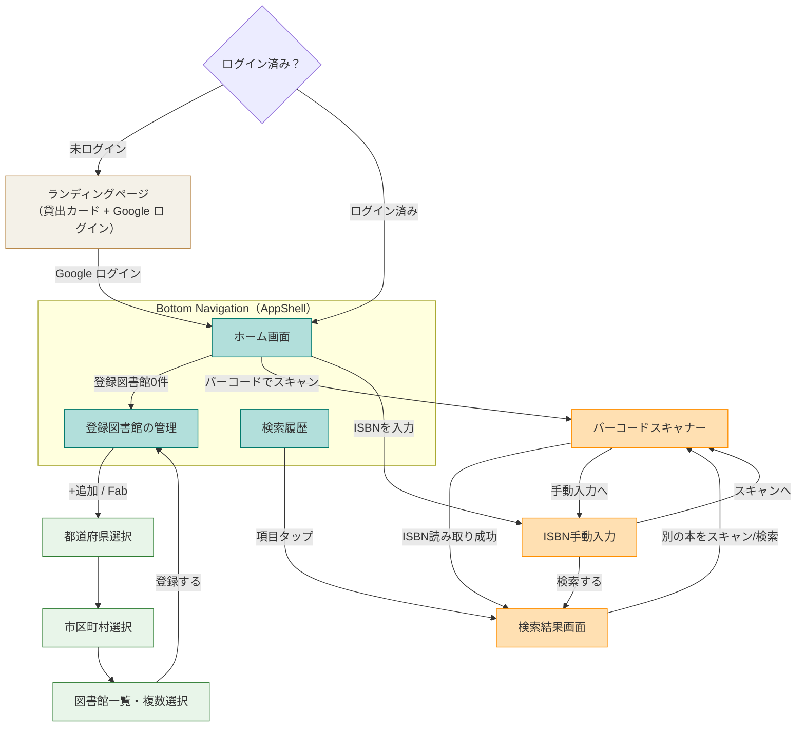

# LibCheck デザインガイドライン

> 本書は実装（React 18 / TypeScript / MUI）を正本として記述する。デザインコンセプトは
> **Knowledge Cartography**（#138、由来: `screenshots/feature_graphic_philosophy.md`）。
> 「羊皮紙の地に浮かぶ貸出カード」を世界観の核とし、Google ログイン必須のランディング
> ページ（#113）で確立したトークンをアプリ全体（`src/theme.ts`）に展開している。
> トークンの正本は `src/presentation/theme/tokens.ts`。旧 Flutter 版（Material Design 3
> 既定の teal/amber パレット）の資料ではない点に注意。

## 1. デザイントークン

### 1.1 カラーパレット（Knowledge Cartography）

正本: `src/presentation/theme/tokens.ts` の `KC_COLORS`。

| トークン | Hex | 用途 |
|---------|-----|------|
| `verdigris` | `#0E3B36` | AppBar・ランディングフッター等の濃色面 |
| `teal`（primary） | `#00796B` | CTA・アクセント・カード上辺の罫 |
| `parchment`（background.default） | `#F4F1E8` | アプリ全体の背景（羊皮紙） |
| `card`（background.paper） | `#FBF8F0` | カード面（羊皮紙よりやや明るい） |
| `brass` | `#B8894B` | カード罫・請求記号風ラベル・ミシン目 |
| `stampRed` | `#C0392B` | ランディングの「貸出可能」スタンプ（唯一の大胆な差し色） |
| `ink`（text.primary） | `#23302D` | 本文 |
| `inkSoft`（text.secondary） | `#5A6360` | 補助テキスト |

#### セマンティックカラー（蔵書状態・`AvailabilityStatusBadge`）

MUI テーマの `success`/`warning`/`error` を使う（`src/theme.ts`）。

| 状態（`AvailabilityStatus`） | ラベル | カラー | アイコン |
|------|--------|--------|---------|
| `available` | 貸出可能 | `success.main` (`#2E7D32`) | `CheckCircle` |
| `inLibraryOnly` | 館内のみ | `success.main` | `CheckCircle` |
| `checkedOut` | 貸出中 | `warning.main` (`#EF6C00`) | `Schedule` |
| `reserved` | 予約中 | `warning.main` | `Schedule` |
| `preparing` | 準備中 | `warning.main` | `Schedule` |
| `closed` | 休館中 | `grey.500` (`#9E9E9E`) | `Block` |
| `notFound` | 蔵書なし | `grey.500` | `RemoveCircleOutline` |
| `error` | エラー | `error.main` (`#D32F2F`) | `ErrorOutline` |
| `unknown` | 不明 | `grey.500` | `HelpOutline` |

オフラインバナー（後述 4.3）は `warning.main`/`warning.contrastText` を使う。

### 1.2 タイポグラフィ

| 用途 | フォントスタック | 定数 |
|------|------|------|
| 本文全般 | `BIZ UDGothic` / `Hiragino Sans` / `Noto Sans JP` / sans-serif | `theme.typography.fontFamily` |
| 見出し（`h5`/`h6`/`subtitle1`）・ランディングの大見出し | `Hiragino Mincho ProN` / `Yu Mincho` / `Noto Serif JP` / serif（明朝、weight 600） | `KC_SERIF` |
| ISBN・請求記号風ラベル等のデータ表記 | `SFMono-Regular` / `Menlo` / `Consolas` / `BIZ UDGothic` / monospace | `KC_MONO` |

すべて OS 標準搭載の system フォントのみで構成し、Web フォントは読み込まない
（CSP の `style-src`/`font-src` 変更が不要、追加リクエストなしで高速）。
タイポグラフィスケールは MUI 既定の Type Scale をそのまま使用し、独自の sp 値定義は持たない。

### 1.3 コンポーネントスタイル（MUI ベース）

`src/theme.ts` の `components` オーバーライド:

- **`MuiAppBar`**（`colorPrimary`）: 背景を `verdigris`（濃い緑青の帯）。ランディングフッターと同じ語彙
- **`MuiCard`**: `brass` の細罫（1px, 33%透過）+ 控えめな影（`0 8px 20px -16px rgba(14,59,54,0.4)`）

個別画面で使う語彙（テーマ外・都度指定）:
- 検索結果の ISBN カード（`IsbnSection`）・蔵書状況カード（`LibraryAvailabilityCard`）: 上辺に `teal` の 3px 罫（「貸出カード」の意匠、#138 Phase 2）
- `AvailabilityStatusBadge`: 状態色の 1.5px ボーダー角丸バッジ（スタンプの語彙。ランディングの「貸出可能」スタンプと同系だが一覧で煩くならないよう回転はさせない）
- ボタン: `variant="contained"`（主要アクション）/ `"outlined"`（副次アクション）/ `"text"`（軽微なアクション、例: 予約リンク）。MUI 既定のスタイルをそのまま使用し、カスタム角丸等は指定しない

## 2. 画面構成（実装ベース）

ルーティングは `src/app/router.tsx` が正本。`/`・`/library`・`/history` の3画面は
`AppShell`（BottomNavigation 付きの共通シェル）配下、それ以外は `SubPageAppBar`
（戻るボタン付きの単純な AppBar）を持つ独立画面。

### 2.0 未ログイン: ランディングページ（`/`、`AuthGate` 経由）

`src/presentation/landing/LandingPage.tsx`。ログイン必須（`AuthGate`）のため、未ログイン時は
アプリ本体ではなく紹介 + ログイン誘導のランディングを表示する。

構成: **ヒーロー（`HeroCard`）→ 使い方（`HowItWorks`）→ できること（`Features`）→ 安心（`Trust`）
→ フッター（`LandingFooter`）**。背景は羊皮紙 + ごく薄い横罫線（罫紙の質感）。

`HeroCard` は署名的要素＝図書館の「貸出カード」を模したカード:
- 請求記号風ラベル「010 · LIBCHECK」+ 破線罫
- ワードマーク「LibCheck」（明朝・teal）
- 大見出し「その本、いつもの／図書館にありますか。」（明朝）
- 本文 + Google ログイン CTA（`GoogleSignInControl oneTap`）
- ミシン目（破線）
- 返却カード風フッター行「DATE DUE」+ 「貸出可能」スタンプ（`stampRed`、-7度回転）
- 利用規約・プライバシーポリシーへの同意文言

### 2.1 ホーム画面（`/`、ログイン後）

`HomePage.tsx`。登録図書館が0件なら `/library` へ自動リダイレクト（オンボーディング、#64）。

```
┌──────────────────────────────────┐
│  LibCheck              [Auth]    │  ← AppShell AppBar（verdigris 背景）
├──────────────────────────────────┤  ← オフライン時のみバナー（2.7参照）
│                                  │
│           📖 MenuBookIcon        │
│      図書館の蔵書をかんたん検索      │
│                                  │
│  ┌──────────────────────────┐    │
│  │  📷 バーコードでスキャン    │    │  ← contained button
│  └──────────────────────────┘    │
│  ┌──────────────────────────┐    │
│  │  ⌨ ISBNを入力            │    │  ← outlined button
│  └──────────────────────────┘    │
│                                  │
│       利用規約  プライバシーポリシー │
│                                  │
├──────────────────────────────────┤
│  [ホーム]   [図書館]   [履歴]     │  ← BottomNavigation
└──────────────────────────────────┘
```

### 2.2 図書館登録フロー

#### 2.2.1 登録図書館の管理（`/library`、`LibraryManagementPage.tsx`）

- 空状態: アイコン + 「図書館が登録されていません」+ 登録導線ボタン
- 登録済み: `ListItem`（館名 + 都道府県市区町村、末尾に削除アイコン）の一覧 + 右下 `Fab`（追加）
- 削除は確認ダイアログ → 削除後 Snackbar に「元に戻す」アクション（Undo）

#### 2.2.2 都道府県選択（`/library/add`、`PrefectureSelectionPage.tsx`）
#### 2.2.3 市区町村選択（`/library/add/:pref`、`CitySelectionPage.tsx`）
#### 2.2.4 図書館一覧・複数選択（`/library/add/:pref/:city`、`LibraryListPage.tsx`）

チェックボックス付きリストで複数選択 → 「選択した図書館を登録する（n件選択中）」ボタンで
一括登録し、`/library` へ遷移して Snackbar で完了を通知する。いずれも `SubPageAppBar`（戻るボタン付き）。

### 2.3 バーコードスキャナー画面（`/scan`、`BarcodeScannerPage.tsx`）

`@zxing/browser` で EAN-13（ISBN バーコード）に絞ってデコード。

- カメラ映像 + `ScanOverlayWidget`（半透明のガイド枠オーバーレイ）
- `SubPageAppBar` 右端にフラッシュ（トーチ）切替（非対応端末では非表示相当に振る舞う）
- ISBN 以外のバーコード（価格・分類コード）を読んだ場合は継続スキャンしつつ
  「ISBNのバーコード（978で始まる上段）を映してください」を Snackbar で通知（3秒スロットル）
- ISBN 認識に成功したら振動フィードバック（`navigator.vibrate`）→ `/result/:isbn?source=scan`
- カメラ権限拒否時（`CameraPermissionErrorWidget`）・取得失敗時（`CameraErrorWidget`）は
  それぞれ専用のエラー画面 + 再試行 + 手動入力への導線
- 「ISBNを手動入力する」ボタンで `/isbn-input` へ

### 2.4 ISBN 手動入力画面（`/isbn-input`、`IsbnInputPage.tsx`）

- `TextField`（`type="text"`。ISBN-10 のチェックディジット `X` やハイフンを許容するため数値専用入力にしない）
- リアルタイムバリデーション（`isbnValidator`）。エラーメッセージ / 「有効なISBNです」を表示
- 「検索する」（`disabled` はバリデーション通過まで）→ `/result/:isbn?source=isbn`
- 「バーコードスキャンへ」で `/scan` へ

### 2.5 検索結果画面（`/result/:isbn`、`BookSearchResultPage.tsx`）

状態別に4つのビュー（`LoadingState` / `ErrorState` / `NoLibraryState` / `ResultState`）を出し分ける。
共通して先頭に ISBN カード（`IsbnSection`。上辺 teal 罫 + 等幅 ISBN 表記）と
書影・タイトルカード（`BookMetadataCard`。OpenBD → Amazon の順でフォールバック）を表示する。

```
┌──────────────────────────────────┐
│  [←] 検索結果                    │
├──────────────────────────────────┤
│ ┌──────────────────────────┐     │  ← IsbnSection（teal 上辺罫）
│ │ 📕 ISBN: 978-4-...        │     │
│ └──────────────────────────┘     │
│ [書影]  タイトル（OpenBD）        │  ← BookMetadataCard
│                                  │
│  蔵書状況                        │
│ ┌──────────────────────────┐     │
│ │ 🏛 図書館名                │     │  ← LibraryAvailabilityCard
│ │    都道府県市区町村         │     │     （在庫状況順にソート）
│ │    [🟢 貸出可能]           │     │     ← AvailabilityStatusBadge
│ │    予約する（該当時のみ）    │     │
│ └──────────────────────────┘     │
│         ...（登録図書館の数だけ）  │
│                                  │
│  ┌──────────────────────────┐    │
│  │ 📷/🔍 別の本をスキャン/検索 │    │  ← source=scan/isbn で文言を出し分け
│  └──────────────────────────┘    │
└──────────────────────────────────┘
```

- 蔵書状況の並びは `sortLibrariesByAvailability`（貸出可能を優先表示）
- 「予約する」ボタンは `reserveUrl` が有効な http(s) URL かつ予約可能状態のときのみ表示（安全な URL のみリンク化）
- 結果取得成功時、検索履歴（分館単位・enum 名で保存、#55）を自動保存
- 図書館未登録時は `NoLibraryState`（登録導線ボタンのみ、蔵書状況は出さない）

### 2.6 検索履歴画面（`/history`、`SearchHistoryPage.tsx`）

- 各エントリは `SearchHistoryCard`: 書影サムネイル（`BookCoverThumbnail`）+ タイトル（OpenBD、#141）+
  ISBN（タイトル取得時は補助表記に降格）+ 検索日時 + 蔵書状況サマリー
- タップで `/result/:isbn` へ（再検索）
- 個別削除（行の削除アイコン）/ 一括削除（右上アイコン → 確認ダイアログ）
- 空状態: アイコン + 「検索履歴はありません」

### 2.7 オフライン対応（PWA、#72・#143・#145）

`useOnlineStatus`（`navigator.onLine` + `online`/`offline` イベント購読）を用いる。

- **エラーメッセージの一本化**（`resolveErrorMessage`、`ErrorStateWidget` / 検索結果画面のエラー表示）:
  オフライン中はエラー種別によらず「オフラインです。接続を確認してください」に統一
- **常時バナー**（`AppShell`。AppBar 直下、`warning.main` 背景）:
  - ホームタブ: 「オフラインです」
  - 図書館・履歴タブ: 「オフラインです。表示中のデータは前回取得時点のものです」
    （#143 で `GET /api/registered-libraries`・`/api/search-history` を Workbox
    NetworkFirst でキャッシュし、オフラインでも最後に取得した内容を閲覧できるようにしたため）
  - `SubPageAppBar` 配下の画面（スキャン・ISBN入力・結果等）にはこのバナーは出ない
- `/api/calil/*`（蔵書状況）は意図的にキャッシュ対象外。古い在庫情報を見せるのは有害なため、
  オフライン時は通常どおりエラー扱いになる
- ログアウト時にオフラインキャッシュ（`api-user-data`）を削除し、同一端末での別ユーザーへの
  データ残存を防ぐ（`clearOfflineApiCache`）

---

## 3. ナビゲーション

### 3.1 ナビゲーション構造

`AppShell`（`src/presentation/pages/AppShell.tsx`）が BottomNavigation による3タブを提供する。

| タブ | ラベル | アイコン | 画面 |
|------|--------|---------|------|
| 1 | ホーム | `Home` | `HomePage`（`/`） |
| 2 | 図書館 | `LocalLibrary` | `LibraryManagementPage`（`/library`） |
| 3 | 履歴 | `History` | `SearchHistoryPage`（`/history`） |

タブ配下以外（スキャン・入力・図書館登録フロー・結果画面）は `SubPageAppBar`
（戻るボタン付き AppBar、履歴が無ければホームへフォールバック）を持つ独立画面。

### 3.2 画面遷移フロー


```mermaid
flowchart TD
    Auth{"ログイン済み？"}
    Landing["ランディングページ<br/>（貸出カード + Google ログイン）"]

    subgraph BottomNav["Bottom Navigation（AppShell）"]
        Home["ホーム画面"]
        Library["登録図書館の管理"]
        History["検索履歴"]
    end

    Auth -->|"未ログイン"| Landing
    Landing -->|"Google ログイン"| Home
    Auth -->|"ログイン済み"| Home
    Home -->|"登録図書館0件"| Library

    Home -->|"バーコードでスキャン"| Scanner["バーコードスキャナー"]
    Home -->|"ISBNを入力"| ManualInput["ISBN手動入力"]

    Scanner -->|"ISBN読み取り成功"| Result["検索結果画面"]
    Scanner -->|"手動入力へ"| ManualInput
    ManualInput -->|"検索する"| Result
    ManualInput -->|"スキャンへ"| Scanner
    Result -->|"別の本をスキャン/検索"| Scanner

    Library -->|"+追加 / Fab"| Prefecture["都道府県選択"]
    Prefecture --> City["市区町村選択"]
    City --> LibraryList["図書館一覧・複数選択"]
    LibraryList -->|"登録する"| Library

    History -->|"項目タップ"| Result

    style Landing fill:#F4F1E8,stroke:#B8894B
    style Home fill:#B2DFDB,stroke:#00796B
    style Library fill:#B2DFDB,stroke:#00796B
    style History fill:#B2DFDB,stroke:#00796B
    style Scanner fill:#FFE0B2,stroke:#FF8F00
    style ManualInput fill:#FFE0B2,stroke:#FF8F00
    style Result fill:#FFE0B2,stroke:#FF8F00
    style Prefecture fill:#E8F5E9,stroke:#2E7D32
    style City fill:#E8F5E9,stroke:#2E7D32
    style LibraryList fill:#E8F5E9,stroke:#2E7D32
```

### 3.3 ルーティング定義（`src/app/router.tsx` が正本）

```
/                        → ホーム画面（AppShell タブ1。未ログインはランディング）
/library                 → 登録図書館の管理（AppShell タブ2）
/library/add             → 都道府県選択
/library/add/:pref       → 市区町村選択
/library/add/:pref/:city → 図書館一覧・複数選択
/scan                    → バーコードスキャナー
/isbn-input              → ISBN手動入力
/result/:isbn            → 検索結果（?source=scan|isbn で戻り先ボタンの文言を出し分け）
/history                  → 検索履歴（AppShell タブ3）
```

---

## 4. ユーザーインタラクションパターン

### 4.1 ローディング状態

- 全画面/セクション: `CircularProgress` + 補足テキスト（例:「蔵書を検索中...」「図書館情報を取得中...」）
- カーリル API はポーリング方式のため、蔵書検索の結果は登録図書館ごとに順次揃う想定
  （現状の結果画面は登録図書館すべての結果が揃ってから表示する実装）

### 4.2 エラー状態

- **通信エラー**（`ErrorStateWidget` / 検索結果画面の `ErrorState`）: エラー種別ごとに
  `resolveErrorMessage` がメッセージを出し分け（ネットワーク不通・タイムアウト・
  サーバエラー・パース失敗・不明）、オフライン中は上記 2.7 の統一メッセージに一本化。
  「再試行」ボタンで再取得
- **カメラ権限エラー**: `CameraPermissionErrorWidget`。設定を開く導線 + 手動入力への切替
- **カメラ取得エラー**（権限以外）: `CameraErrorWidget`。再試行 + 手動入力への切替
- **入力バリデーションエラー**: `TextField` の `error`/`helperText`（ISBN 桁数・チェックディジット）
- **描画時の未捕捕捉例外**: ルート直下の `errorElement`（`RouteErrorFallback`）で白画面を防止（#117）。
  Sentry（`src/sentry.ts`）へ自動送信

### 4.3 空状態（Empty State）

- 図書館未登録（`LibraryManagementPage` / 検索結果画面の `NoLibraryState`）:
  アイコン + 案内文 + 「図書館を登録する」ボタン
- 検索履歴なし（`SearchHistoryPage`）: アイコン + 「検索履歴はありません」

### 4.4 成功フィードバック

- 図書館登録・登録解除・検索履歴の一括削除: `notistack` の Snackbar。
  破壊的操作（登録解除・履歴削除）には「元に戻す」Undo アクション付き
- バーコード読み取り成功: 振動フィードバック（対応端末のみ）+ 自動的に結果画面へ遷移

### 4.5 確認ダイアログ

- 図書館の登録解除、検索履歴の一括削除は MUI `Dialog` による確認を必須とする
  （破壊的操作は必ず確認 → Snackbar の Undo で二重に取り消し可能にする）

---

## 5. 関連ドキュメント

- デザイン刷新（Knowledge Cartography 導入）の経緯・意思決定: `docs/138-design-refresh/design.md`
- PWA・オフライン対応の経緯: `docs/143-offline-history-viewing/`、Issue #72・#144・#145
- ランディングページ刷新の実装: `src/presentation/landing/`（Issue/PR #113 として実装、専用 docs フォルダなし）
