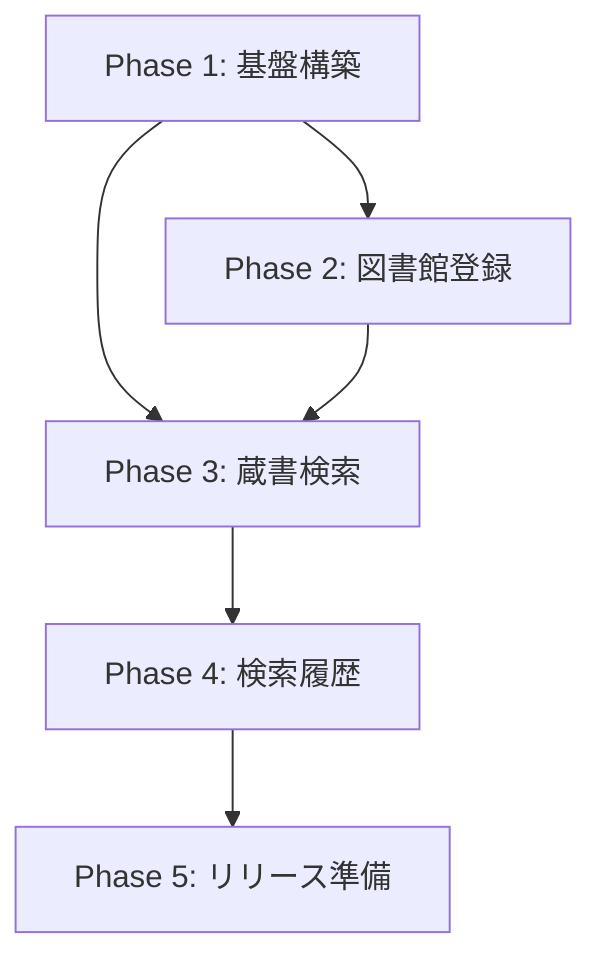

# LibCheck ロードマップ

カメラでISBNのバーコードを撮影し、普段利用している図書館に蔵書があるかどうかを確認するAndroidアプリケーション。

## 前提

- 技術スタック: Flutter / Dart
- 外部API: [カーリル 図書館API](https://calil.jp/doc/api_ref.html)
- 対応OS: Android

## Phase 1: プロジェクト基盤構築

アプリ全体のアーキテクチャを整え、以後の開発を円滑に進めるための土台を作る。

| # | Issue | 概要 |
|---|-------|------|
| 1 | プロジェクト構造の整理 | Clean Architecture に基づくディレクトリ構成、レイヤー分離の導入 |
| 2 | 状態管理の導入 | Riverpod 等の状態管理パッケージを選定・導入 |
| 3 | ローカルストレージの導入 | shared_preferences または Hive 等でデータ永続化の基盤を用意 |
| 4 | カーリルAPI クライアントの実装 | http パッケージを用いたAPIクライアント基盤。図書館検索・蔵書検索エンドポイント対応 |

## Phase 2: 図書館登録機能

ユーザーが普段利用する図書館を登録・管理できるようにする。

| # | Issue | 概要 |
|---|-------|------|
| 5 | 都道府県・市区町村選択UI | 都道府県 → 市区町村の2段階選択フォームを実装 |
| 6 | 図書館一覧表示・選択 | カーリルAPI から取得した図書館一覧を表示し、登録対象を選べるようにする |
| 7 | 登録図書館の管理 | 複数図書館の登録・削除・一覧表示。ローカルストレージに永続化 |

## Phase 3: 蔵書検索機能（コア機能）

ISBN から蔵書の有無・貸出状況を確認するアプリの中核機能。

| # | Issue | 概要 |
|---|-------|------|
| 8 | ISBNバーコードスキャン | カメラを使った ISBN バーコード（EAN-13）の読み取り機能 |
| 9 | ISBN手動入力 | バーコードが読み取れない場合のフォールバックとして ISBN を手入力できるフォーム |
| 10 | 蔵書検索・結果表示 | カーリルAPI の蔵書検索エンドポイントを呼び出し、登録図書館ごとの蔵書有無・貸出状況を表示 |

## Phase 4: 検索履歴機能

過去に検索した書籍の履歴を端末内に保存し、後から参照できるようにする。

| # | Issue | 概要 |
|---|-------|------|
| 11 | 検索履歴の保存 | 検索した ISBN・書籍情報・結果をローカルストレージに保存 |
| 12 | 検索履歴一覧・再検索 | 履歴一覧画面の実装。履歴から蔵書状況の再検索が可能 |

## Phase 5: 品質向上・リリース準備

アプリの品質を高め、リリースに向けた準備を行う。

| # | Issue | 概要 |
|---|-------|------|
| 13 | エラーハンドリング・UX改善 | ネットワークエラー、API エラー、カメラ権限拒否などのエラーケース対応。ローディング表示の統一 |
| 14 | UIデザインの仕上げ | アプリアイコン、テーマカラー、レイアウトの統一感を整える |
| 15 | E2Eテスト・リリースビルド | Integration test の追加。Android リリースビルドの設定 |

## 依存関係

## 技術選定（案）

| カテゴリ | パッケージ候補 | 備考 |
|----------|---------------|------|
| 状態管理 | flutter_riverpod | 宣言的で testability が高い |
| HTTP | http / dio | カーリルAPI通信用 |
| ローカルストレージ | shared_preferences | 図書館登録・検索履歴の永続化 |
| バーコードスキャン | mobile_scanner | カメラによるバーコード読み取り |
| ルーティング | go_router | 画面遷移管理 |
