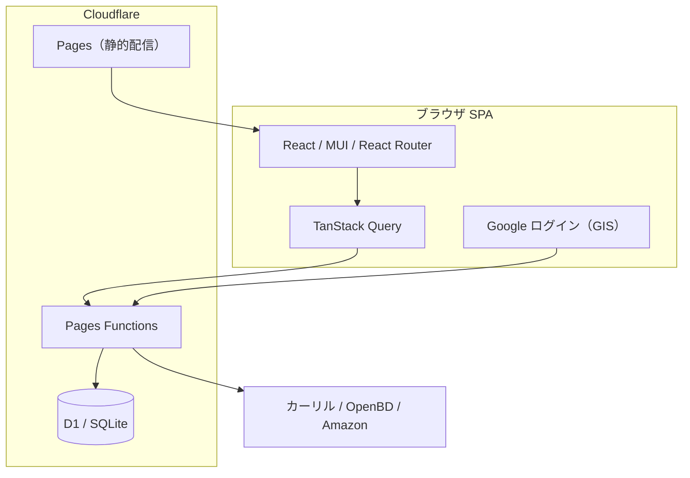

# LibCheck ロードマップ

カメラで ISBN のバーコードを撮影し、普段利用している図書館に蔵書があるかを確認する **Web アプリケーション**。

## 前提（現状）

- 技術スタック: React 18 / TypeScript / Vite、MUI、TanStack Query、React Router v7
- 認証: Google ログイン（Google Identity Services + `jose`）。**必須ログイン**
- バックエンド / 配信: Cloudflare Pages + Pages Functions、永続化は Cloudflare D1
- 外部 API: [カーリル図書館 API](https://calil.jp/doc/api_ref.html)（蔵書/図書館検索・サーバ側でキー注入）、OpenBD（書名・書影）、Amazon（書影・アソシエイトリンク）
- アーキテクチャ: Clean Architecture（domain / data / presentation）
- 構成の詳細は [`../README.md`](../README.md) / [`cloudflare-runbook.md`](cloudflare-runbook.md) を参照

> 旧版は Flutter / Android / ローカル保存の単体アプリだった。React へ移植後、Azure SWA → Cloudflare へ移設し、認証・サーバ永続化を追加した（経緯は各 Issue / Cosense「LibCheck」日誌）。

## 完了済みマイルストーン

- ✅ **MVP（蔵書検索の中核）**: 図書館登録 → ISBN スキャン/入力 → 蔵書状況表示 → 検索履歴
- ✅ **Flutter → React/Vite 移植**
- ✅ **書誌情報表示**: OpenBD 書名・書影 + Amazon 書影/アソシエイトリンク
- ✅ **検索結果の在庫状況順ソート**
- ✅ **Azure SWA → Cloudflare 移設**（#78・完了/クローズ）: Pages + Functions + GitHub Actions デプロイ、Bicep/Azure 撤去、軽量 IaC runbook 化
- ✅ **認証（#73）**: Google ログイン（GIS）、ローカル認証モック
- ✅ **永続化（#74）**: 登録図書館・検索履歴を D1 にユーザー単位で保存（端末間同期）
- ✅ **D1 マイグレーション運用化（#83）**: `wrangler d1 migrations` + CI 自動適用
- ✅ **HttpOnly Cookie セッション（#91）**: リロードでも再認証不要（XSS 窃取不可・CSRF 対策）
- ✅ **セキュリティ堅牢化**: セキュリティヘッダ + CSP enforce（#87 / #93）、永続化 API の入力検証（#87）、Calil プロキシの認証必須化 + キャッシュ（#89）
- ✅ **プライバシーポリシー（#102）**: 現状反映の全面改訂・アプリから参照可能化
- ✅ **OAuth 同意画面の本番公開（#105）**: 「対象」= 本番環境。非機微スコープのみで審査不要。本番 Client ID へ移行済み
- ✅ **リロード維持の本番確認（#91）**: ログイン→リロード維持→ログアウトを実機確認

## 公開前ブロッカー: すべて解消 ✅

コード・インフラ・法務（プライバシーポリシー・利用規約）・認証の公開前準備はすべて完了し、**いつでも一般公開できる状態**。正規 URL は独自ドメイン **`https://libcheck.app`**（apex を正規とし、Cloudflare Pages 既定の `libcheck.pages.dev` でも到達可能）。

## 公開後の予定（バックログ）

| Issue | 概要 | 区分 |
|---|---|---|
| #71 | カスタムドメイン `libcheck.app`（apex 正規）の適用・正規化（www→apex リダイレクト、OAuth 生成元追加） | infra（対応中） |
| #72 | PWA 対応（インストール可能・オフライン） | enhancement |
| #76 | アクセス解析の導入（Google Analytics 等。導入時はプライバシーポリシー更新） | analytics |
| #100 | フロントエンドレビュー P2（状態分割 / データ層整理 / クエリ設定 / ログ削除） | refactor |
| — | デザイン刷新（テーマの図書カード化など、現状は概ね既定 MUI） | design |
| — | dev での実 Google ログイン対応（dev/prod 差分の更なる縮小） | DX |

## アーキテクチャ概観

