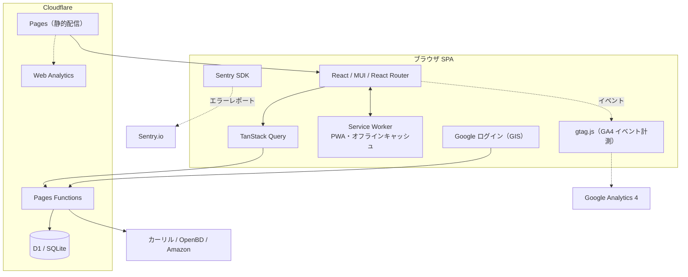

# LibCheck ロードマップ

カメラで ISBN のバーコードを撮影し、普段利用している図書館に蔵書があるかを確認する **Web アプリケーション**。

## 前提（現状）

- 技術スタック: React 18 / TypeScript / Vite、MUI、TanStack Query、React Router v7
- 認証: Google ログイン（Google Identity Services + `jose`）。**必須ログイン**
- バックエンド / 配信: Cloudflare Pages + Pages Functions、永続化は Cloudflare D1
- 外部 API: [カーリル図書館 API](https://calil.jp/doc/api_ref.html)（蔵書/図書館検索・サーバ側でキー注入）、OpenBD（書名・書影）、Amazon（書影・アソシエイトリンク）
- アーキテクチャ: Clean Architecture（domain / data / presentation）
- 構成の詳細は [`../README.md`](../README.md) / [`cloudflare-runbook.md`](cloudflare-runbook.md) を参照

> 旧版は Flutter / Android / ローカル保存の単体アプリだった。React へ移植後、Azure SWA → Cloudflare へ移設し、認証・サーバ永続化を追加した（経緯は各 Issue / Cosense「LibCheck」日誌）。

## 完了済みマイルストーン

- ✅ **MVP（蔵書検索の中核）**: 図書館登録 → ISBN スキャン/入力 → 蔵書状況表示 → 検索履歴
- ✅ **Flutter → React/Vite 移植**
- ✅ **書誌情報表示**: OpenBD 書名・書影 + Amazon 書影/アソシエイトリンク
- ✅ **検索結果の在庫状況順ソート**
- ✅ **Azure SWA → Cloudflare 移設**（#78）: Pages + Functions + GitHub Actions デプロイ、Bicep/Azure 撤去、軽量 IaC runbook 化
- ✅ **認証（#73）**: Google ログイン（GIS）、ローカル認証モック
- ✅ **永続化（#74）**: 登録図書館・検索履歴を D1 にユーザー単位で保存（端末間同期）
- ✅ **D1 マイグレーション運用化（#83）**: `wrangler d1 migrations` + CI 自動適用
- ✅ **HttpOnly Cookie セッション（#91）**: リロードでも再認証不要（XSS 窃取不可・CSRF 対策）。リロード維持を実機確認済み
- ✅ **セキュリティ堅牢化**: セキュリティヘッダ + CSP enforce（#87 / #93）、永続化 API の入力検証（#87）、Calil プロキシの認証必須化 + キャッシュ（#89）
- ✅ **フロントエンドレビュー P1 / P2**（#95 / #100）: 予約リンクの安全化・スペーサー/テーマ色統一、状態分割・データ層整理・クエリ設定・ログ削除
- ✅ **検索履歴の堅牢化**（#115）: 上限（100件）を超えたら古いものから切り捨て、保存が壊れる不具合を修正
- ✅ **検索履歴にタイトル・書影を表示**（#141）: OpenBD 一括取得。未取得時は ISBN 表記に自然フォールバック
- ✅ **描画クラッシュ対策**（#117）: ルートに `errorElement` を追加し白画面を防止
- ✅ **フロントエンドのエラー監視**（#118）: Sentry 導入
- ✅ **法務ページ**: プライバシーポリシー（#102）・利用規約（#109）を現状反映・アプリ内から参照可能化
- ✅ **OAuth 同意画面の本番公開（#105）**: 「対象」= 本番環境。非機微スコープのみで審査不要。本番 Client ID へ移行済み
- ✅ **公開仕上げ**（#116）: OGP/Twitter カード・robots.txt・`www` → apex 正規化（301）
- ✅ **カスタムドメイン（#71）**: `libcheck.app`（apex 正規）を適用。配信・TLS・Functions・CSP・法務ページ・Google ログインを新ドメインで確認
- ✅ **アクセス解析**（#76）: Cloudflare Web Analytics（ビーコン）を導入。当初は PV/UU 把握が目的だったため Google Analytics は見送った
- ✅ **GA4 のイベント計測**（#169）: 価値到達のファネル（ISBN 読み取り → 検索結果表示 → 図書館の予約リンク）と収益化（Amazon リンク）を最小4イベントで計測。#76 の「GA は見送り」は目的が PV 把握からイベント分析へ変わったため更新。Cloudflare Web Analytics とは併用
- ✅ **公開後運用の runbook 化**（#119）: D1 バックアップ・復旧（Time Travel）とユーザーデータ削除手順を `cloudflare-runbook.md` に整備
- ✅ **デザイン刷新「Knowledge Cartography」**（#138）: ランディングページ（#113、貸出カード意匠）で確立したトークンをアプリ全体のテーマへ展開。詳細は `docs/design-guidelines.md`
- ✅ **PWA 対応**（#72）: インストール可能 + 高速化。個人データ API はキャッシュしない方針で導入
- ✅ **PWA オフライン改善**: 接続断時に親切なメッセージ・バナー表示（#145）、登録図書館・検索履歴のオフライン閲覧（#143）

## 公開前ブロッカー: すべて解消 ✅

コード・インフラ・法務（プライバシーポリシー・利用規約）・認証の公開前準備はすべて完了し、**いつでも一般公開できる状態**。正規 URL は独自ドメイン **`https://libcheck.app`**（apex を正規とし、Cloudflare Pages 既定の `libcheck.pages.dev` でも到達可能）。すでに一般公開済み。

## 現在の予定（バックログ）

| Issue | 概要 | 区分 |
|---|---|---|
| #144 | PWA: オフライン中にスキャンした ISBN を貯めて復帰後に自動検索（レベル3）。Calil のポーリング方式と Background Sync の単発リクエストモデルの整合という未解決の設計課題あり | enhancement |
| — | dev での実 Google ログイン対応（dev/prod 差分の更なる縮小） | DX |

## アーキテクチャ概観

より詳細な本番構成図は [`production-architecture.drawio.png`](production-architecture.drawio.png)（draw.io で編集可）を参照。

```mermaid
graph TD
    subgraph client[ブラウザ SPA]
      UI[React / MUI / React Router]
      RQ[TanStack Query]
      SW[Service Worker<br/>PWA・オフラインキャッシュ]
      AUTH[Google ログイン（GIS）]
      SENTRY[Sentry SDK]
      GA[gtag.js（GA4 イベント計測）]
    end
    subgraph cf[Cloudflare]
      PAGES[Pages（静的配信）]
      FN[Pages Functions]
      D1[(D1 / SQLite)]
      CFA[Web Analytics]
    end
    EXT[カーリル / OpenBD / Amazon]

    UI --> RQ --> FN
    UI <--> SW
    AUTH --> FN
    FN --> D1
    FN --> EXT
    PAGES --> UI
    SENTRY -.->|エラーレポート| ExtSentry[Sentry.io]
    UI -.->|イベント| GA -.-> ExtGA[Google Analytics 4]
    PAGES -.-> CFA
```
